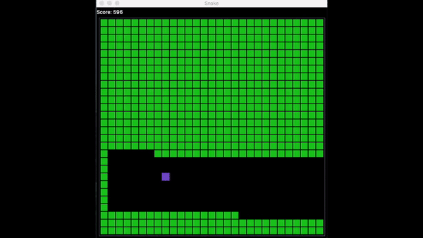

# Snake
Groupe : Raphaël Robert, Léo Sablong, Zhifeng Liang, Etienne Roseau.


Le jeu Snake a été écrit sur Notebook en Python 3.8.3.

Il comporte 4 versions du jeu : 

  - La version habituelle : l'utilisateur manipule le snake avec les touches Z,Q,S et D.
  - L'IA Hamiltonienne : le snake suit un circuit passant par toutes les cases du jeu.
  - L'IA shortest path : le snake se dirige automatiquement vers la pomme.
  - L'IA shortest path evolved : de même, le snake s'oriente vers la pomme mais il évite d'avantage d'obstacles.


# Composition du code

Le programme a été divisé en 2 parties :

  - L'interface et la version classique
  - L'intelligence artificielle

### L'interface et la version classique

> 1) Importation des différentes libraries
```python
import tkinter as tk
import random
import re
from tqdm import tqdm
import matplotlib.pyplot as plt
#import de notebook
import nbimporter
from snake_ia import Snake_ia
```
___
> 2) Class Snake_game
```python
class Snake_game :
    def __init__(self, tinker, size = 400, play_btn = True, game_speed = 150):
```
→ définition de la taille du serpent, sa vitesse, la taille du tableau, le score, etc.
```python
    "PLAY AS PLAYER" [...] "PLAY AS SHORTEST" [...]"PLAY AS EVOLVED SHORTEST" [...] "PLAY AS HAMILTONIAN" 
```

→ ajout des boutons choix de version du jeu. 
```python
    game_speed = 0.1
```
→ ajustement de la vitesse en fonction de la version (très rapide pour les IA : 0.1, lente pour la version jouable : 120).

```python
    def create_canvas(self):
```
→ terrain noir sur lequel évolue le snake.
```python
    def create_grid(self): 
```
→ coordonnées du snake.
```python
    def play(self):
```
→ lancement du jeu, association du snake, du terrain, position de la pomme.
```python
    def game_over(self, canvas):
```
→ écran noir, texte et score.

___

> 3) class Apple :
```python
class Apple (Snake_game):
    def __init__(self, tinker, game_size, apple_position):
```
```python
    def create_apple(self, canvas):
```
→ initialisation de la pomme.
```python
    def update_apple(self, canvas, apple_id, snake_positions, apple_position):
```
→ réapparition de la pomme après avoir été mangée.

___
> 4) class Snake :
```python
class Snake (Snake_game) :
    def __init__(self, tinker, game_size, canvas, apple, apple_position):
```
→ position du snake, initialisation des commandes et des directions.
```python
    def set_key_event(self, event, canvas, apple):
```
→ association des directions aux touches du clavier.
```python
def init_snake(self):
```
→ apparition du snake.
```python
    def add_snake_part(self, posx, posy):
```
→ ajout d'une unité au snake après ingestion de la pomme.
```python
    def update_snake(self, snake_id, position):
```
→ mouvements de chaque unitée du snake.
```python
    def perform_actions(self):
```
→ déroulement du jeu.
```python
    def move(self) :
```
→ mouvements de tout le snake en fonction des directions.
```python
    def is_touched(self):
```
→ détection des obstacles.
```python
    def ia_call(self):
```
→ appel des differentes intelligences.
___

  

> 5) Appel de la class Tk pour lancer le jeu :
```python
root = tk.Tk()
snake_game = Snake_game(root)
root.mainloop()
```
→ Cette cellule lance une seule partie.
___
### L'intelligence artificielle

> 1) class Snake_ia :
```python
class Snake_ia :
    def __init__(self, head_position, food_position, direction, game_size, snake_positions, reverse_commands):
```
> 2) méthode IA shortest_path :
```python
    def shortest_path(self):
```
→ L'IA s'oriente directement vers la pomme. Elle ne prend pas en compte son corps (celui du snake) comme un obstacle. Elle ne donc va pas s'éviter et ne tolère pas les boucles. De même, lorsque la pomme apparaît derrière le snake sur la même ligne, l'IA se mange elle-même (exemple ci-dessous).


> 3) méthode IA evolved_shortest_path : 
```python
    def evolved_shortest_path(self):
```
→ Cette IA se déplace également vers la pomme mais elle évite les obstacles. Elle prend en compte ce qui l'entours d'une case et enregistre les mouvements interdits. Elle peut éviter son corps et les demi-tours immédiats.


> 4) méthode IA Hamiltonienne : 
```python
    def hamiltonian(self):
```
→ Cette IA suit un circuit hamiltonien : https://en.wikipedia.org/wiki/Hamiltonian_path.
Le snake passe par toutes les cases du jeu une seule fois, puis il recommence. Il ne se croise donc jamais. Cette méthode gagne toujours mais elle est extrêmement lente. On pourrait presque ne pas la considérer comme une véritable IA car il n'y a aucune prise de décision, pas de comportement évolutif.

___

# Les assets

Ce dossier contient les images statistiques et celles du Readme.md
___

# Data
Nous avons utilisé "matplotlib" pour comparer la moyenne cumulée des scores de chaque partie, pour 100 parties en tout.
```python
def get_mean(score_rsult):
    mean = []
    count = 1
    for j in score_rsult:
        mean.append(round(sum(score_rsult[:count-1])/count, 1))
        count += 1
    return mean

index_list = [i for i in range (1, len(move_count_rsults_evolved_shortest_path)+1)]
#print("Moyenne générale :", sum(score_rsults)/len(score_rsults))
#print("Meilleur score :", max(score_rsults))

fig, ax = plt.subplots(figsize=(15,8))
ax.plot(index_list, get_mean(score_rsults_shortest_path), color='blue')
ax.plot(index_list, get_mean(score_rsults_evolved_shortest_path), color='orange')

ax.set(xlabel='Parties', ylabel='score moyen',
       title='moyenne cummulée du score')
ax.grid()
ax.legend(["shortest_path", "evolved_shortest_path"])
plt.show()
```
Voici nos résultats pour l'IA shortest_path et l'IA shortest_path_evolved :

On remarque que l'IA shortest_path_evolved tend vers un meilleur score.


